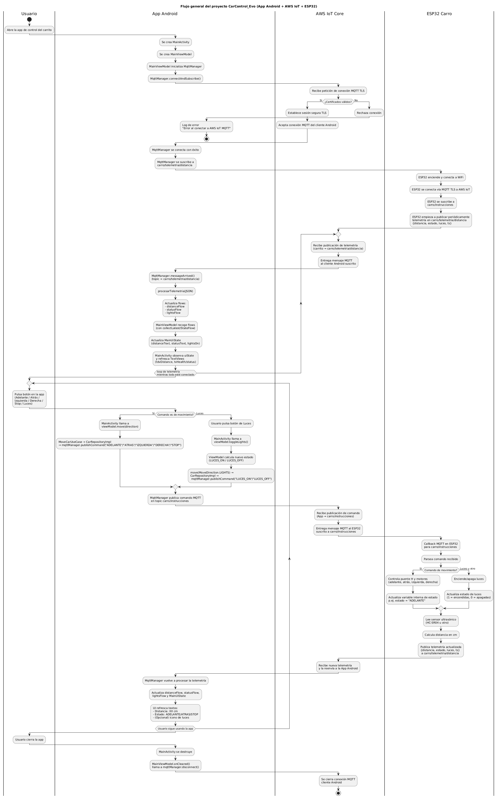

# CarControl_Evo

Danna Alejandra Sanchez Monsalve y Juan Pablo Vargas Jimenez

Sistema IoT de control de un carro 2WD basado en ESP32, controlado desde una aplicación móvil Android vía MQTT seguro (TLS) sobre AWS IoT Core.

Este proyecto integra:

- Firmware para ESP32 (carrito 2WD con sensor ultrasónico y luces).
- Backend de mensajería usando AWS IoT Core (broker MQTT con TLS).
- Aplicación Android nativa en Kotlin para control remoto y visualización de telemetría.

## 1. Descripción general

CarControl_Evo es un proyecto académico de IoT y robótica que consiste en un carro 2WD controlado mediante un ESP32. El vehículo se conecta a Internet y se comunica con **AWS IoT Core** usando el protocolo **MQTT sobre TLS**, publicando telemetría y recibiendo comandos de movimiento.

La aplicación Android actúa como interfaz gráfica de usuario, permitiendo:

- Enviar comandos de movimiento (adelante, atrás, izquierda, derecha, stop).
- Encender/apagar luces del carro.
- Visualizar en tiempo real la **distancia medida por el sensor ultrasónico**.
- Mostrar el **estado actual** del carro (ADELANTE, ATRAS, STOP, etc.).

Todo el flujo de datos pasa por AWS IoT Core utilizando certificados X.509 para asegurar el canal de comunicación.

## 2. Arquitectura de alto nivel

La arquitectura general del sistema se puede resumir así:

1. **Usuario**

   - Interactúa con la app Android (botones de movimiento, luces, etc.).

2. **App Android (Kotlin)**

   - Módulo `presentation` con `MainActivity` y `MainViewModel`.
   - Módulo `data` con `MqttManager` y `CarRepositoryImpl`.
   - Módulo `domain` con modelos (`MoveDirection`) y casos de uso.
   - Publica comandos en `carro/instrucciones` a través de AWS IoT.
   - Se suscribe a `carro/telemetria/distancia` para recibir telemetría.

3. **AWS IoT Core**

   - Actúa como broker MQTT seguro (TLS, certificados X.509).
   - Gestiona topics:
     - `carro/instrucciones` (comandos desde la app hacia el carro).
     - `carro/telemetria/distancia` (telemetría desde el carro hacia la app).

4. **ESP32 (Carro 2WD)**

   - Conectado a WiFi y a AWS IoT Core vía MQTT TLS.
   - Motores controlados a través de un puente H.
   - Sensor ultrasónico (ej. HC-SR04) para medir distancia frontal.
   - Luces (LEDs) controladas digitalmente.
   - Firmware desarrollado con PlatformIO (C++ / Arduino core para ESP32).

5. **Hardware del Carro**
   - Chasis 2WD.
   - ESP32 (módulo WROOM-32).
   - Puente H (por ejemplo L298N).
   - Sensor ultrasónico (HC-SR04 o similar).
   - Luces (LEDs) y posiblemente buzzer.
   - Baterías, switch de encendido/apagado.

### Diagrama de flujo



## 3. Características principales

- ✅ Control remoto desde Android mediante botones táctiles:
  - Adelante / Atrás / Izquierda / Derecha / Stop.
- ✅ Control de luces del carro (ON / OFF).
- ✅ Lectura en tiempo real de distancia (cm) por MQTT.
- ✅ Visualización del **estado del carro** (ADELANTE, ATRAS, STOP, etc.).
- ✅ Comunicación segura con AWS IoT usando TLS y certificados X.509.
- ✅ Arquitectura relativamente limpia en Android (presentation / domain / data).
- ✅ Uso de corrutinas y `StateFlow` para manejar telemetría en tiempo real en la app.

## 4. Requisitos

### 4.1 Hardware

- 1x **ESP32** (ej. ESP-WROOM-32).
- 1x Chasis 2WD con:
  - 2 motores DC.
  - Ruedas y soporte.
- 1x **Puente H** (ejemplo: L298N) para controlar los motores.
- 1x **Sensor ultrasónico** (HC-SR04 o similar).
- 1x Juego de **LEDs** para luces.
- Baterías para alimentación del carro.
- Switch de encendido/apagado.
- Cableado y protoboard según montaje.

### 4.2 Software

- **PlatformIO** + VSCode para el firmware del ESP32.
- **Android Studio** para la aplicación móvil (Kotlin). [repositorio de la app](https://github.com/dany040518/App_CarControl-Evo)
- **Cuenta en AWS** con acceso a **AWS IoT Core**.
- Certificados X.509 generados en AWS IoT para el dispositivo ESP32.
- Herramientas de línea de comando para subir el firmware al ESP32.

## 5. Configuración de AWS IoT Core

1. Crear un **"Thing"** en AWS IoT para el ESP32.
2. Generar **certificados X.509** (certificado, clave privada y CA de Amazon).
3. Adjuntar una **política de IoT** que permita al dispositivo:
   - Conectarse al endpoint MQTT.
   - Publicar en `carro/telemetria/distancia`.
   - Suscribirse a `carro/instrucciones`.
   - Publicar/recibir en cualquier otro topic necesario.
4. Descargar:
   - `device-certificate.pem.crt`
   - `private.pem.key`
   - `AmazonRootCA1.pem` (u otro CA correspondiente).
5. Copiar estos archivos al proyecto del **ESP32** y/o empaquetarlos de la forma adecuada para el firmware (según implementación específica).
6. En la app Android, configurar:
   - `AppConfig.MQTT_BROKER_URI` → endpoint de AWS IoT en formato `ssl://xxxx-ats.iot.<region>.amazonaws.com:8883`.
   - `AppConfig.MQTT_CLIENT_ID_ANDROID` → clientId único para la app Android.

> Importante: la app Android también utiliza TLS para conectarse a AWS IoT, por lo que en `SslSocketFactory` se debe configurar correctamente la CA y la fábrica de sockets segura.

## 6. Firmware del ESP32 (Carro)

### 6.1 Funcionalidad principal

- Conectar a una red WiFi configurada (SSID/Password).
- Establecer conexión MQTT segura con AWS IoT usando certificados.
- Suscribirse al topic:
  - `carro/instrucciones`.
- Publicar periódicamente en el topic:
  - `carro/telemetria/distancia`.
- Controlar motores mediante un puente H según los comandos recibidos.
- Leer la distancia usando el sensor ultrasónico y enviarla como telemetría.
- Encender/apagar luces según comandos recibidos.

### 6.2 Payload de telemetría

El ESP32 publica mensajes en formato JSON, por ejemplo:

```json
{
  "distancia": 89,
  "estado": "STOP",
  "luces": 0,
  "ts": 31540
}
```

Donde:

- `distancia`: distancia medida por el sensor ultrasónico (en cm).
- `estado`: estado del carro (ej. `ADELANTE`, `ATRAS`, `IZQUIERDA`, `DERECHA`, `STOP`).
- `luces`: 1 si las luces están encendidas, 0 si están apagadas.
- `ts`: timestamp o contador interno (según implementación).

## 7. Aplicación Android (ControlCarrito)

### 7.1 Paquete principal

- Nombre de paquete:
  - `com.jpvj.controlcarrito`

### 7.2 Principales clases

- `AppConfig.kt`

  - Contiene configuración de MQTT (endpoint, clientId, topics, etc.).

- `SslSocketFactory.kt`

  - Fabrica `SSLSocketFactory` a partir de la CA de AWS IoT para crear conexiones TLS.

- `data/mqtt/MqttManager.kt`

  - Administra la conexión MQTT con AWS IoT desde Android.
  - Suscribe al topic `carro/telemetria/distancia`.
  - Publica comandos en `carro/instrucciones`.
  - Expone `StateFlow`:
    - `distanceFlow: StateFlow<Float?>`
    - `statusFlow: StateFlow<String>`
    - `lightsFlow: StateFlow<Boolean?>`

- `data/repository/CarRepositoryImpl.kt`

  - Implementación del repositorio que usa `MqttManager`.
  - Proporciona métodos de alto nivel para el dominio: mover carro, observar distancia, etc.

- `domain/model/MoveDirection.kt`

  - Enum que representa las direcciones/acciones:
    - `FORWARD`, `BACKWARD`, `LEFT`, `RIGHT`, `STOP`, `LIGHTS`.

- `domain/usecase/MoveCarUseCase.kt`

  - Traduce `MoveDirection` a comandos MQTT (`ADELANTE`, `ATRAS`, `IZQUIERDA`, `DERECHA`, `STOP`, `LUCES_ON`, `LUCES_OFF`).

- `domain/usecase/ObserveDistanceUseCase.kt`

  - Devuelve un `Flow<Float?>` con las distancias leídas desde MQTT.

- `presentation/main/MainUiState.kt`

  - Data class que representa el estado de la UI:
    - `statusText`: texto del estado del carro (ADELANTE, ATRAS, STOP, etc.).
    - `distanceText`: texto con la distancia "XX.X cm".
    - `isLoading`: para estados de carga (si se usan).
    - `errorMessage`: para mostrar errores.
    - `lightsOn`: booleano para estado de luces.

- `presentation/main/MainViewModel.kt`

  - Maneja:
    - Conexión y suscripción MQTT (`mqttManager.connectAndSubscribe()`).
    - Colección de `distanceFlow` y `statusFlow` para actualizar `MainUiState`.
    - Métodos `move(direction: MoveDirection)` y `toggleLights()`.

- `presentation/main/MainActivity.kt`
  - Asocia botones (adelante, atrás, izquierda, derecha, stop, luces) con el `ViewModel`.
  - Observa `uiState` y actualiza `TextView`:
    - `tvHealth` → ahora se usa para mostrar el `statusText` del carro.
    - `tvDistance` → muestra la distancia en cm.

## 8. Layout principal de la app Android

El layout principal (por ejemplo `activity_main.xml`) define:

- `TextView` para el estado del carro:

  - `@+id/tvHealth`
  - Texto inicial: `"Estado: Desconocido"`.
  - Se actualiza desde `statusText` de `MainUiState`.

- `TextView` para la distancia:

  - `@+id/tvDistance`
  - Texto inicial: `"Distancia: -- cm"`.

- `ImageView` y `Button` para controles:
  - `@+id/btnForward` (Adelante).
  - `@+id/btnBackward` (Atrás).
  - `@+id/btnLeft` (Izquierda).
  - `@+id/btnRight` (Derecha).
  - `@+id/btnStop` (Stop, tipo `Button`).
  - `@+id/btnLights` (Luces, tipo `ImageView`).

Los recursos gráficos (`@drawable/adelante`, `@drawable/atras`, etc.) representan las flechas y el icono de luces.

## 9. Topics MQTT y protocolo de mensajes

### 9.1 Topics

- **Comandos hacia el carro**

  - Topic: `carro/instrucciones`
  - Tipo de mensaje: `String` simple (texto plano).

- **Telemetría desde el carro**
  - Topic: `carro/telemetria/distancia`
  - Tipo de mensaje: JSON.

### 10.2 Comandos soportados (carro/instrucciones)

- `ADELANTE`
- `ATRAS`
- `IZQUIERDA`
- `DERECHA`
- `STOP`
- `LUCES_ON`
- `LUCES_OFF`

Estos comandos son publicados por la app Android y consumidos por el ESP32.

### 9.3 Formato de telemetría (carro/telemetria/distancia)

```json
{
  "distancia": 100,
  "estado": "ADELANTE",
  "luces": 1,
  "ts": 54040
}
```

La app Android parsea este JSON en `MqttManager.procesarTelemetria(jsonStr)` y actualiza los flujos internos y la UI.

## 10. Guía rápida de uso

1. **Montar el carrito**

   - Conectar el ESP32 al puente H, motores, sensor ultrasónico y luces.
   - Verificar polaridad de alimentación y baterías.

2. **Configurar AWS IoT**

   - Crear Thing, certificados y política.
   - Configurar topics y permisos.

3. **Subir firmware al ESP32**

   - Abrir el proyecto `firmware_esp32` en PlatformIO.
   - Configurar SSID/Password WiFi y endpoint MQTT en el código o en `config.h`.
   - Cargar certificados en el firmware (según la implementación).
   - Compilar y subir al ESP32.

4. **Configurar app Android**

   - Abrir el módulo `android_app` en Android Studio.
   - En `AppConfig.kt`, configurar `MQTT_BROKER_URI` y `MQTT_CLIENT_ID_ANDROID`.
   - Asegurarse de que `SslSocketFactory` tenga la CA correcta de AWS IoT.
   - Construir e instalar la app en un dispositivo Android.

5. **Ejecutar el sistema**

   - Encender el carro (ESP32 + puente H + baterías).
   - Confirmar que el ESP32 se conecte a WiFi y a AWS IoT.
   - Abrir la app Android.
   - Verificar que aparezcan valores de distancia en tiempo real.
   - Probar los botones de movimiento y las luces.

6. **Monitoreo en AWS**
   - Usar la consola de AWS IoT Core para revisar los mensajes en los topics.
   - Verificar que el carro publique telemetría y reciba comandos correctamente.

## 11. Posibles errores y resolución de problemas

### 11.1 La app no se conecta a AWS IoT

- Revisar logs en Android (tag `AWS-IoT-MQTT`).
- Verificar `MQTT_BROKER_URI` y `clientId`.
- Confirmar que la CA en `SslSocketFactory` coincide con la de AWS IoT.
- Revisar reglas de red / firewall (puerto 8883 abierto).

### 11.2 No llega telemetría de distancia a la app

- Verificar que el ESP32 está publicando en `carro/telemetria/distancia`.
- Confirmar en la consola de AWS IoT que se reciben mensajes en ese topic.
- Revisar que `MqttManager` esté suscrito correctamente al mismo topic.
- Revisar que el JSON desde el ESP32 tenga las claves `distancia`, `estado` y `luces`.

### 11.3 El carro no se mueve

- Verificar que los comandos se publiquen en `carro/instrucciones`.
- Comprobar en AWS IoT que el ESP32 está suscrito y recibiendo esos mensajes.
- Revisar cableado del puente H y motores.
- Confirmar que el ESP32 interpreta correctamente los comandos (`ADELANTE`, `ATRAS`, etc.).

### 11.4 Las luces no responden pero los comandos se envían

- Revisar la lógica de `LUCES_ON` y `LUCES_OFF` en el firmware del ESP32.
- Confirmar que el pin de los LEDs esté bien configurado como salida.
- Verificar alimentación y resistencia limitadora si aplica.

## 12. Mejoras futuras (Roadmap)

- Añadir **ESP32-CAM** para transmisión de video y/o captura de imágenes.
- Implementar un **servidor web** en el ESP32 para control local sin Internet.
- Crear una **dashboard web** adicional (React, por ejemplo) consumiendo datos desde AWS.
- Añadir **detección de obstáculos automática** y frenado de emergencia.
- Guardar logs de telemetría en una base de datos (DynamoDB, por ejemplo) para análisis posterior.
- Usar más principios de **Clean Architecture / Hexagonal** en todo el proyecto.
- Internacionalización de la app (ES/EN).

## 13. Créditos y autoría

- Proyecto desarrollado como parte de un curso de **IoT**.
- Integración de:
  - **ESP32 + PlatformIO** para firmware.
  - **AWS IoT Core** para mensajería MQTT segura.
  - **Android (Kotlin)** para la aplicación móvil.
